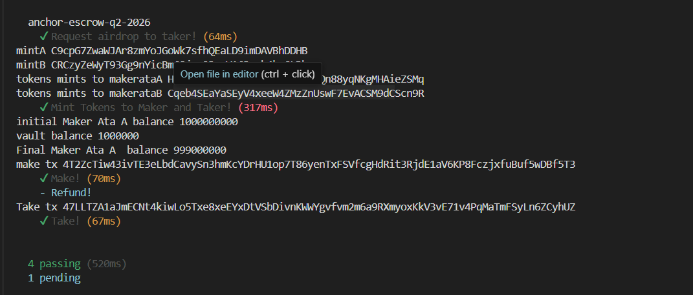
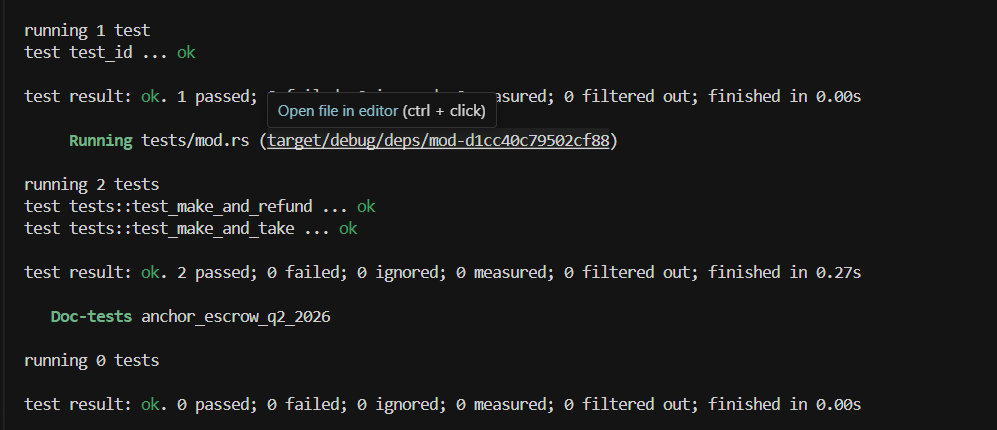

# Anchor Escrow Q2 2026

A trustless token escrow program built with Anchor on Solana. The maker deposits Token A into a vault and specifies how much Token B they want in return. A taker fulfills the trade by sending Token B to the maker and receiving Token A from the vault. The maker can also reclaim their tokens via a refund at any time before the trade is taken.

## Program Architecture

```
programs/anchor-escrow-q2-2026/src/
├── lib.rs                  # Program entry point & instruction dispatch
├── state.rs                # Escrow account state
├── constants.rs            # Seeds and constants
├── error.rs                # Custom error codes
└── instructions/
    ├── make.rs             # Maker deposits Token A, initializes escrow
    ├── take.rs             # Taker fulfills trade, vault is closed
    └── refund.rs           # Maker reclaims Token A, escrow is closed
```

### Escrow State

| Field     | Type     | Description                          |
|-----------|----------|--------------------------------------|
| `seed`    | `u64`    | Random seed for PDA derivation       |
| `maker`   | `Pubkey` | Maker's wallet address               |
| `mint_a`  | `Pubkey` | Token the maker is offering          |
| `mint_b`  | `Pubkey` | Token the maker wants in return      |
| `receive` | `u64`    | Amount of Token B the maker expects  |
| `bump`    | `u8`     | PDA bump seed                        |

### Instructions

- **`make(seed, receive, deposit)`** — Initializes the escrow PDA and vault ATA, transfers `deposit` amount of Token A from the maker into the vault.
- **`take()`** — Transfers `receive` amount of Token B from the taker to the maker, then withdraws all Token A from the vault to the taker and closes the vault.
- **`refund()`** — Returns all Token A from the vault back to the maker and closes both the vault and escrow accounts.

## Tests

The test suite covers the full lifecycle using both a TypeScript integration test (via `anchor test`) and native Rust unit tests using LiteSVM.

### TypeScript Integration Tests



All 4 integration tests pass (1 pending = Refund skipped while Take runs):

```
anchor-escrow-q2-2026
  ✔ Request airdrop to taker! (64ms)
  ✔ Mint Tokens to Maker and Taker! (317ms)
  ✔ Make! (70ms)
  - Refund! (pending)
  ✔ Take! (67ms)

4 passing (520ms)
1 pending
```

### Rust Unit Tests (LiteSVM)



```
running 2 tests
test tests::test_make_and_refund ... ok
test tests::test_make_and_take   ... ok

test result: ok. 2 passed; 0 failed
```

## Getting Started

### Prerequisites

- [Rust](https://rustup.rs/)
- [Solana CLI](https://docs.solana.com/cli/install-solana-cli-tools)
- [Anchor CLI](https://www.anchor-lang.com/docs/installation)
- Node.js + Yarn

### Install dependencies

```bash
npm install
```

### Build

```bash
anchor build
```

### Test

```bash
anchor test
```

## Program ID

```
7ZHXZ7oZM8HcdabybMbtR3NYEureJNPLBWGfakMHdhvW
```
